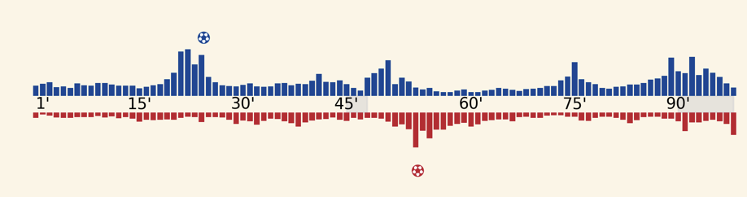
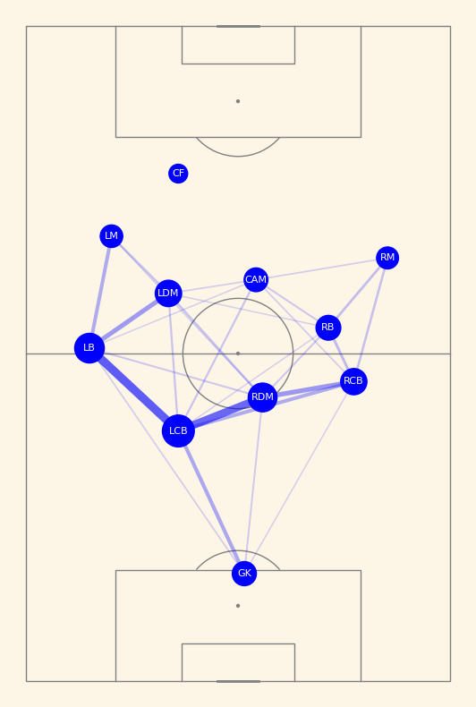
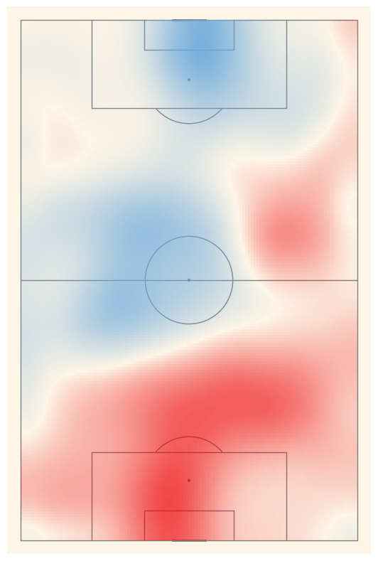

# footballexamples

This project is a collection of tutorials on processing football data and using `matplotlib` to create data visualisation.

These tutorials assume basic familiarity with python, pandas and matplotlib.

Example data is included for each tutorial.  Each of these example files can be easily generated from Opta event data.  Unfortunately, for reasons that are beyond this readme, I can't provide any help with actually sourcing the raw data for these visualisations.

## Included tutorials
1. [Gameflow Chart](tutorials/gameflow.ipynb) - This is a tutorial for generating a gameflow chart commonly seen on SofaScore and other sites.  It shows the attacking threat generated by each team through a timeline of bar charts, each bar representing a portion of the match, where longer bars indicate more attacking threat generated by the team.  The tutorial will show you how to make a gameflow chart that looks like the image below and place it within the context of a larger matplotlib figure

2. [Passing Network Chart](tutorials/passing_network.ipynb) - This is a tutorial for generating a simple passing network, indicating the average position and most common passing combination between teammates in a single match.

3. [Possession/Action density heatmap](tutorials/heatmap.ipynb) - This is a tutorial for creating a heapmap that shows which team dominated which areas of the pitch during a match.

